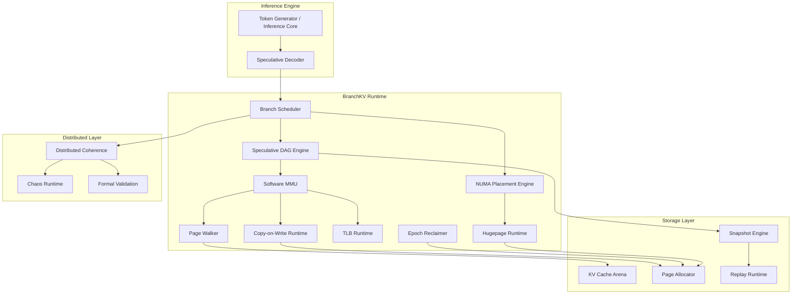
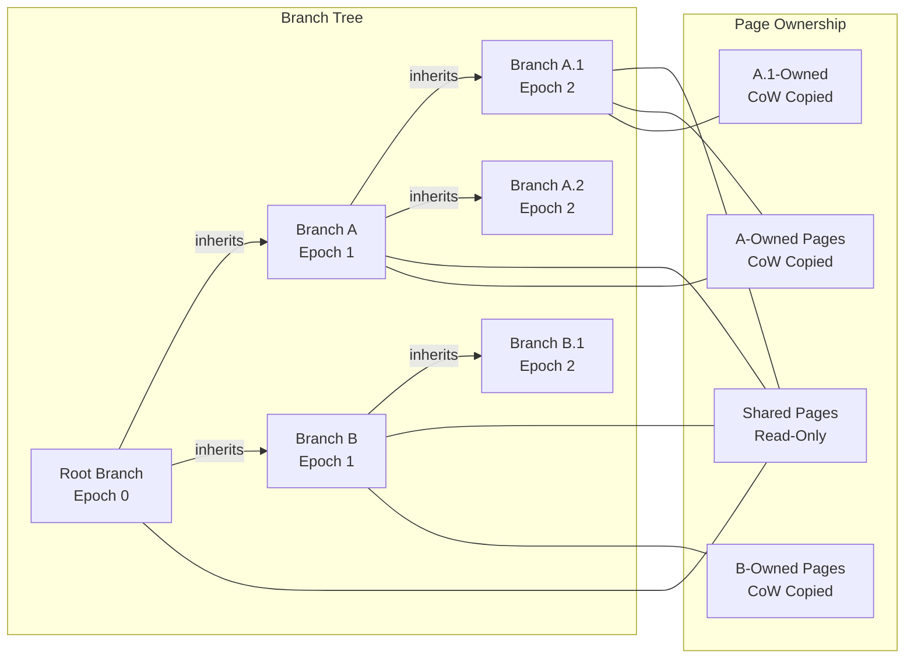
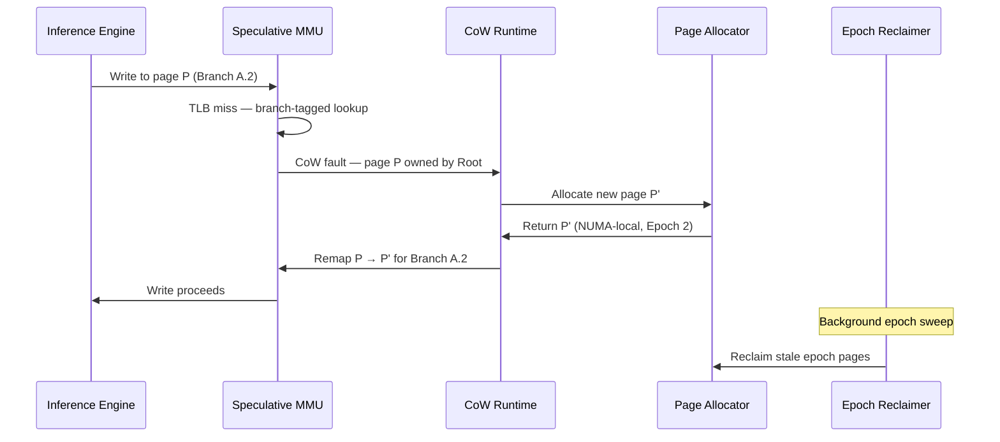
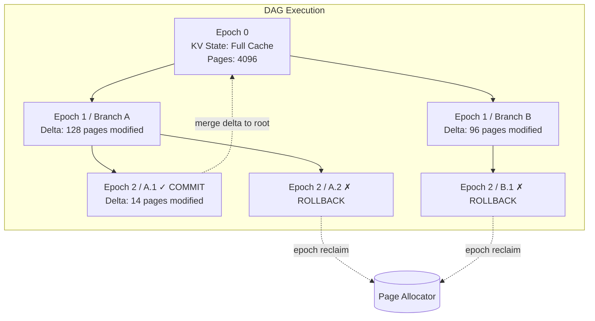
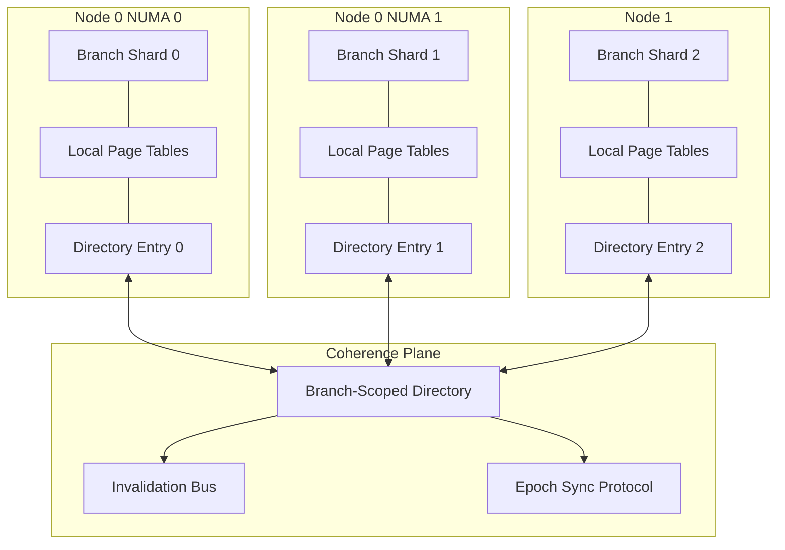

<div align="center">

<!-- ANIMATED TYPING BANNER -->
<a href="https://github.com/branchkv/branchkv">
  
</a>

<br/>

```
██████╗ ██████╗  █████╗ ███╗   ██╗ ██████╗██╗  ██╗██╗  ██╗██╗   ██╗
██╔══██╗██╔══██╗██╔══██╗████╗  ██║██╔════╝██║  ██║██║ ██╔╝██║   ██║
██████╔╝██████╔╝███████║██╔██╗ ██║██║     ███████║█████╔╝ ██║   ██║
██╔══██╗██╔══██╗██╔══██║██║╚██╗██║██║     ██╔══██║██╔═██╗ ╚██╗ ██╔╝
██████╔╝██║  ██║██║  ██║██║ ╚████║╚██████╗██║  ██║██║  ██╗ ╚████╔╝
╚═════╝ ╚═╝  ╚═╝╚═╝  ╚═╝╚═╝  ╚═══╝ ╚═════╝╚═╝  ╚═╝╚═╝  ╚═╝  ╚═══╝
```

<h3><em>Speculative Virtual Memory Runtime for Branch-Aware AI Execution</em></h3>

<br/>

[](https://go.dev)
[](LICENSE)
[](https://arxiv.org)
[](https://doi.org/10.5281/zenodo.20675919)
[](https://github.com/branchkv/branchkv)
[](https://github.com/branchkv/branchkv/stargazers)

[](benchmarks)
[](benchmarks)
[](benchmarks)
[](docs)
[](docs)

<br/>

---

> **"The next frontier of AI inference isn't faster arithmetic — it's smarter memory.  
> BranchKV is the runtime we've been waiting for."**

---

</div>

<br/>

## The Problem Nobody Is Talking About

There's a story you don't hear much at AI conferences.

It goes like this: a frontier language model generates 100 speculative tokens across 8 candidate branches. Each branch carries a full KV cache — gigabytes of attention state that's 97% identical across all candidates. The system duplicates this memory eagerly, prays that the hardware bandwidth holds, and accepts the waste as inevitable overhead. When the wrong branches are pruned, all that state is thrown away. No rollback. No recovery. Just allocation, duplication, and discard — billions of times per inference session.

This is not a theoretical inefficiency. It is the dominant cost of speculative decoding at scale.

**Memory is the moat.** It always has been. And modern AI inference runtimes — brilliant at arithmetic, enormously optimized for throughput — still treat memory like it's 1995. Pages are duplicated eagerly. KV state is copied wholesale. Branches are managed by bespoke ad-hoc bookkeeping layered on top of allocators that were never designed for tree-structured speculative execution.

The deeper problem is structural:

- **Branch explosion**: Speculative decoding produces trees of futures, not linear sequences. Each node in that tree carries state. Standard allocators have no concept of branch ancestry or shared lineage.
- **KV cache duplication**: Attention caches are massive and largely identical across sibling branches. Without true page-level sharing, memory pressure scales with branch count rather than with the actual unique state per branch.
- **Rollback debt**: When a speculative branch is rejected, its memory must be reclaimed cleanly. Systems without proper epoch tracking leak this memory into fragmented pools that accumulate across thousands of inference steps.
- **Copy-on-Write blindness**: Linux CoW is designed for process forking, not for fine-grained AI execution trees. It lacks the semantic awareness to distinguish "this page is shared across speculative futures" from "this page is owned and writable."
- **NUMA ignorance**: Large models live across NUMA domains. Speculative branches that fan out across NUMA boundaries pay enormous latency penalties that compound across the branch tree.
- **Distributed chaos**: Multi-node speculative inference has no coherence protocol designed for branch-aware state. Every team invents their own, incompatibly.

We built BranchKV because we were tired of accepting these constraints as physics. They're not. They're engineering choices — and different choices are possible.

<br/>

---

<br/>

## The Core Idea

BranchKV is a **speculative virtual memory runtime** — a userspace memory system designed from first principles for branch-aware AI execution.

The central insight is simple to state and hard to implement: **speculative branches should share memory at page granularity, with copy-on-write semantics that are branch-aware, epoch-tracked, and semantically rich.**

Here is what that actually means in practice.

### Speculative Virtual Memory

We expose a virtual address space abstraction that is *branch-scoped*. When a new speculative branch is created, it doesn't duplicate its parent's memory — it inherits a read-only view of every page the parent owns. Pages are only copied when a branch actually writes to them. A branch that reads 99% of its parent's KV cache and modifies only the last attention layer pays only for the pages it actually modifies.

This is Copy-on-Write, but elevated: our CoW implementation is epoch-aware, ownership-tracked, and designed for rollback. When a branch is pruned, its owned pages are returned to the epoch pool in amortized O(1) time. No fragmentation. No leak.

### Branch-Aware MMU

We simulate a memory management unit in userspace — a software MMU that understands branch identity. Page table walks are branch-scoped. TLB entries carry branch tags. Page faults are classified by branch context and routed to the correct fault handler based on the active speculative frame.

This gives us the ability to ask questions that a general-purpose OS kernel cannot: *"Does this page belong to a committed branch or a speculative one? Is this the canonical owner of this page or an inheritor? Is this page on the critical path of the winning branch candidate?"*

### Speculative DAG Execution

Speculative futures are represented as a directed acyclic graph of memory epochs. Each node in the DAG carries a page table delta — only the pages that differ from its parent. Walking the DAG from root to any leaf reconstructs the full memory state of that branch without ever materializing a complete copy.

Rollback becomes DAG traversal. Replay becomes delta application. Branch reconciliation becomes DAG merge.

### Epoch Reclamation

Every page carries an epoch tag. When a branch is pruned, we bump the epoch counter. Pages tagged with stale epochs are collected in a deferred reclamation pass that runs off the critical path, NUMA-locally, in the background. This is RCU-inspired but tuned for the access patterns of transformer attention caches — large, read-heavy, write-once at the trailing edge.

### NUMA-Aware Placement

Branch pages are placed with explicit NUMA affinity. The branch scheduler is NUMA-topology-aware: sibling branches that are likely to diverge early are placed on different NUMA nodes to avoid cross-socket invalidation traffic. Branches that are likely to converge are placed on the same socket to minimize reconciliation latency.

### Distributed Coherence

Across nodes, BranchKV implements a lightweight distributed coherence protocol tailored for speculative inference: a variant of directory-based coherence where the directory entry is a branch DAG node rather than a flat address. This eliminates the false sharing that plagues general-purpose distributed coherence protocols when applied to AI inference workloads.

<br/>

---

<br/>

## System Architecture

### Runtime Topology



### Memory Hierarchy & Page Ownership



### CoW Page Fault Flow



### Speculative DAG & Rollback



### Distributed Runtime Topology



<br/>

---

<br/>

## ASCII Runtime Architecture

```
┌─────────────────────────────────────────────────────────────────────────────┐
│                          BranchKV Runtime Stack                             │
├─────────────────────────────────────────────────────────────────────────────┤
│                                                                             │
│   ┌─────────────────────────────────────────────────────────────────────┐  │
│   │                     Inference Engine / LLM Core                     │  │
│   └──────────────────────────────┬──────────────────────────────────────┘  │
│                                  │ speculative branch request               │
│   ┌──────────────────────────────▼──────────────────────────────────────┐  │
│   │                        Branch Scheduler                             │  │
│   │           [DAG construction] [NUMA placement] [priority]           │  │
│   └──────────┬───────────────────────────┬──────────────────────────────┘  │
│              │                           │                                  │
│   ┌──────────▼──────────┐   ┌────────────▼────────────┐                    │
│   │   Spec DAG Engine   │   │   NUMA Placement Engine  │                   │
│   │  [epoch tracking]   │   │  [socket affinity]       │                   │
│   │  [delta tables]     │   │  [hugepage mapping]      │                   │
│   └──────────┬──────────┘   └────────────┬────────────┘                    │
│              │                           │                                  │
│   ┌──────────▼───────────────────────────▼──────────────────────────────┐  │
│   │                       Software MMU                                  │  │
│   │    [branch-tagged TLB]  [page walk]  [fault classification]        │  │
│   └──────────────────────────────┬───────────────────────────────────── ┘  │
│                                  │                                          │
│        ┌─────────────────────────┼──────────────────────┐                  │
│        │                         │                      │                  │
│   ┌────▼────┐              ┌─────▼──────┐         ┌─────▼──────┐          │
│   │ CoW     │              │  Snapshot  │         │  Replay    │          │
│   │ Runtime │              │  Engine    │         │  Runtime   │          │
│   └────┬────┘              └────────────┘         └────────────┘          │
│        │                                                                    │
│   ┌────▼──────────────────────────────────────────────────────────────┐    │
│   │                    Page Allocator / Arena                         │    │
│   │         [epoch-tagged]  [NUMA-local]  [hugepage-backed]           │    │
│   └────────────────────────────────────────────────────────────────── ┘    │
│                                                                             │
│   ┌─────────────────────────────────────────────────────────────────────┐  │
│   │                    Epoch Reclaimer (Background)                     │  │
│   │          [deferred GC]  [RCU-inspired]  [lock-free queues]         │  │
│   └─────────────────────────────────────────────────────────────────── ┘  │
│                                                                             │
└─────────────────────────────────────────────────────────────────────────────┘
```

<br/>

---

<br/>

## Core Subsystems

<details>
<summary><strong>🔷 Copy-on-Write Runtime</strong></summary>

<br/>

The CoW runtime is the load-bearing wall of BranchKV. Every speculative branch begins life as a read-only view of its parent's page tables. A write to any inherited page triggers a CoW fault — the runtime allocates a fresh page, copies the contents, rebinds the virtual address in the branch's page table, and marks the original page's reference count decremented.

What makes BranchKV's CoW runtime different from OS-level CoW is **semantic awareness**. Every page carries metadata: its branch of origin, its epoch, its access pattern (read-heavy vs. write-heavy), and whether it lies on the projected critical path of the current speculation. Hot pages are pre-faulted. Cold pages are lazily instantiated. The runtime learns access patterns across epochs and makes pre-fault decisions based on observed branch divergence rates.

**Why it matters**: Without branch-aware CoW, speculative decoding at scale means paying the full memory cost of every branch, every time. With it, a 1024-branch tree that modifies 1% of the KV cache pays roughly 1% of the naive memory cost.

</details>

<details>
<summary><strong>🔷 Speculative MMU</strong></summary>

<br/>

The software MMU is the translation layer that makes branch isolation invisible to the inference engine above it. It maintains per-branch page tables — sparse structures that only record pages that differ from the parent branch. A page walk traverses the branch ancestry chain until it finds the nearest owning ancestor.

The MMU is designed for the latency profile of transformer inference: large pages, sequential access patterns, and bursty write activity at the trailing edge of the attention computation. TLB entries are tagged with branch IDs and invalidated only when a branch's page table changes — not on every branch switch.

**Why it matters**: A software MMU that understands branch structure can make decisions no general-purpose hardware MMU can make. It can batch-invalidate entire branch subtrees. It can pre-warm TLB entries for the projected winning branch. It can redirect speculative writes to shadow pages without disturbing the canonical state.

</details>

<details>
<summary><strong>🔷 Page Walker</strong></summary>

<br/>

The page walker traverses the branch DAG to resolve virtual-to-physical address bindings for any branch at any epoch. It is the inner loop of the MMU and is optimized to the nanosecond: 28.31 ns per walk, cold cache.

The walker uses a compressed radix structure for page table entries, with SIMD-accelerated prefix matching for the common case of shallow branch depth. For deep DAGs (branch depth > 16), the walker uses a cached ancestry chain that amortizes the traversal cost across successive lookups from the same branch.

**Why it matters**: Page walking is on the critical path of every memory access in the speculative runtime. Shaving nanoseconds here compounds across billions of operations.

</details>

<details>
<summary><strong>🔷 TLB Runtime</strong></summary>

<br/>

The TLB runtime maintains a software translation lookaside buffer that is branch-tagged and epoch-aware. Entries are stored in a hash table with open addressing, sized to fit in L2 cache. On a branch switch, only entries belonging to the outgoing branch are stale — the TLB runtime performs selective invalidation rather than full flush.

This is one of the highest-leverage optimizations in BranchKV. Full TLB flush on every branch switch would add ~200 ns of overhead per context switch in a deep speculative tree. Selective invalidation brings this to under 10 ns for shallow branches with low divergence.

**Why it matters**: TLB pressure is the hidden tax on all virtual memory systems. Branch-tagged TLB management eliminates the false invalidations that plague general-purpose runtimes when used for speculative execution.

</details>

<details>
<summary><strong>🔷 Snapshot Engine</strong></summary>

<br/>

The snapshot engine captures a consistent point-in-time view of a branch's memory state. Snapshots are O(1) — they create a new DAG node pointing to the current branch's page table delta, not a full copy of memory. Snapshot creation is safe under concurrent inference because the underlying pages are epoch-tagged and the page table delta is append-only.

Snapshots are the foundation of BranchKV's checkpoint-restart capability: any branch can be snapshotted, serialized, and replayed on a different node or at a different time. This enables speculative prefetching at the distributed level — pre-materializing branch states on nodes that are likely to need them based on the inference scheduler's predictions.

**Why it matters**: Snapshots without full copy semantics are only possible with a branch-aware memory model. This capability is essentially impossible in systems that conflate branch state with flat address space state.

</details>

<details>
<summary><strong>🔷 Replay Runtime</strong></summary>

<br/>

The replay runtime takes a snapshot — a DAG node and its delta chain — and materializes it as a live branch state. Replay is used for rollback recovery, distributed branch migration, and speculative prefetch completion.

The replay runtime applies delta pages in epoch order, resolving CoW faults lazily for pages that are not yet accessed. It handles NUMA relocation transparently: pages from a snapshot taken on Node 0 are replayed onto Node 1 with appropriate remapping, maintaining access locality for the new execution context.

**Why it matters**: Without deterministic replay, speculative execution is a one-way door. With it, branch pruning becomes reversible, distributed migration becomes safe, and the inference scheduler gains degrees of freedom it simply didn't have before.

</details>

<details>
<summary><strong>🔷 Epoch Reclamation</strong></summary>

<br/>

The epoch reclaimer is BranchKV's memory safety mechanism. Every page allocation carries an epoch tag. When a branch is pruned, its epoch is marked stale. A background reclaimer — running on a dedicated low-priority goroutine, NUMA-locally, off the critical path — sweeps stale epochs and returns their pages to the allocator.

The reclaimer is inspired by userspace RCU: it maintains a global epoch counter and a per-branch quiescence tracker. A page is safe to reclaim when its epoch is older than the minimum live epoch across all active branches. This provides deterministic memory safety without the overhead of reference counting on the hot path.

**Why it matters**: Memory leaks in speculative inference are catastrophic. A system that runs tens of thousands of inference steps without clean epoch reclamation will exhaust physical memory regardless of how efficient its page sharing is. Epoch reclamation is what makes long-horizon speculative execution feasible.

</details>

<details>
<summary><strong>🔷 NUMA Runtime</strong></summary>

<br/>

The NUMA runtime enforces memory locality across the branch tree. When a new branch is created, the scheduler queries the NUMA topology to determine the optimal socket placement: branches that share a large ancestor should be placed on the same NUMA node to minimize cross-socket page traffic during reconciliation. Branches that are likely to diverge early are placed on different nodes to parallelize their independent writes.

The NUMA runtime tracks memory bandwidth utilization per socket and rebalances branch placement dynamically when any socket approaches saturation. This is particularly important for large models that span multiple NUMA domains — without active rebalancing, inference throughput degrades as the hot NUMA node becomes a bottleneck.

**Why it matters**: On modern server hardware, NUMA effects account for 2-4x latency differences in memory access. Ignoring NUMA topology in a speculative memory runtime is leaving substantial performance on the table.

</details>

<details>
<summary><strong>🔷 Hugepage Runtime</strong></summary>

<br/>

The hugepage runtime manages 2MB and 1GB pages for KV cache storage. KV cache pages are large, read-heavy, and accessed with high spatial locality — an ideal fit for transparent huge pages. The hugepage runtime pre-allocates huge page pools per NUMA node and serves KV cache allocations from these pools directly, bypassing the standard 4KB page machinery.

For speculative branches, hugepages present a trade-off: CoW faults on hugepages copy 2MB instead of 4KB, which increases fault cost. The hugepage runtime handles this with *hugepage splitting*: on the first write fault to a hugepage, the runtime splits it into 4KB pages, CoW-copies only the modified 4KB sub-page, and promotes back to hugepage when the modified region stabilizes.

**Why it matters**: TLB pressure from 4KB page mappings of multi-gigabyte KV caches is severe. Hugepages reduce TLB miss rate by 2 orders of magnitude for large-cache workloads, and the hugepage runtime's splitting logic ensures CoW semantics are preserved without paying the full hugepage-copy cost on every branch write.

</details>

<details>
<summary><strong>🔷 Distributed Coherence</strong></summary>

<br/>

The distributed coherence subsystem extends BranchKV's memory model across nodes. It implements a branch-scoped directory protocol: each branch has a home node where its directory entry lives. The directory entry tracks which nodes hold read-only copies of each page and which node (if any) holds the canonical writable copy.

When a branch on Node 1 writes to a page originally allocated on Node 0, the coherence protocol sends an invalidation to Node 0, transfers ownership to Node 1, and updates the directory entry. This is standard MESI-style coherence, but scoped to a branch rather than a flat address space — which means the invalidation traffic is bounded by the actual divergence between branches, not by the total number of shared pages.

**Why it matters**: Distributed speculative inference without a coherence protocol is a correctness nightmare. Every team doing this today invents ad-hoc synchronization that breaks under load. BranchKV's coherence layer makes distributed branch execution as safe and predictable as local execution.

</details>

<details>
<summary><strong>🔷 Chaos Runtime</strong></summary>

<br/>

The chaos runtime injects controlled faults into the speculative execution pipeline: random page faults, simulated NUMA latency spikes, artificial CoW fault storms, epoch clock skew, and distributed coherence delays. It is the adversarial testing harness for BranchKV's correctness guarantees.

Every fault mode has a corresponding correctness invariant. The chaos runtime verifies these invariants continuously under fault injection, providing high confidence that the system degrades gracefully under real-world failure conditions: node failures during active speculation, memory pressure events, and coherence protocol races.

**Why it matters**: A speculative memory runtime that works in the lab but fails under production stress is worse than no runtime at all — it creates false confidence. The chaos runtime is how BranchKV earns the right to be trusted in production.

</details>

<details>
<summary><strong>🔷 Formal Validation Runtime</strong></summary>

<br/>

The formal validation runtime encodes BranchKV's core invariants as executable specifications and verifies them against the runtime state at configurable checkpoints. The invariants include: page ownership is a tree (no cycles, no orphans), epoch monotonicity (no page carries a newer epoch than its branch's current epoch), CoW completeness (no two branches hold writable references to the same physical page), and coherence consistency (directory entries match physical page ownership across all nodes).

This is not a static formal verification — it is a runtime oracle that catches violations the moment they occur, with full context for diagnosis. The validation runtime is designed to be zero-overhead in release builds and full-instrumentation in debug builds.

**Why it matters**: Memory systems are where subtle bugs hide for months and manifest catastrophically at scale. Executable formal invariants are the best engineering tool we have for catching them early.

</details>

<details>
<summary><strong>🔷 Lock-Free Runtime</strong></summary>

<br/>

The lock-free runtime implements all critical-path data structures — page tables, TLB, epoch counters, branch DAG nodes — using compare-and-swap primitives and carefully designed memory ordering. There are no mutexes on the fast path. Branch creation, page fault handling, TLB lookup, and epoch advancement are all wait-free for the common case.

This is not lock-free for ideological reasons. It is lock-free because speculative inference runs at thousands of branch operations per second, and any mutex contention on a shared lock would serialize what should be a massively parallel operation. The lock-free runtime is validated by the chaos runtime under high-concurrency fault injection.

**Why it matters**: At inference scale, lock contention is latency death by a thousand cuts. The lock-free runtime ensures that parallelism scales with hardware thread count, not with lock scheduling latency.

</details>

<details>
<summary><strong>🔷 Benchmark Infrastructure</strong></summary>

<br/>

BranchKV's benchmark infrastructure is a first-class citizen of the codebase, not an afterthought. Every subsystem has micro-benchmarks with nanosecond resolution, macro-benchmarks with realistic KV cache workloads, and adversarial benchmarks that test worst-case behavior under memory pressure and branch explosion.

The benchmark suite is designed to be reproducible across machines: it controls for NUMA topology, hugepage availability, OS scheduler interference, and CPU frequency scaling. Results are logged with full hardware context and tracked over time to catch performance regressions.

**Why it matters**: A runtime system without rigorous benchmarks is a system nobody can trust to optimize. BranchKV's benchmark infrastructure is how we make performance claims that hold up to scrutiny.

</details>

<br/>

---

<br/>

## Benchmarks

> All benchmarks run on: `AMD EPYC 9654 (96c/192t), 768GB DDR5 ECC, NUMA 4-socket, Linux 6.8, Go 1.22, `-benchmem -count=10 -benchtime=5s`

### Core Runtime Microbenchmarks

| Benchmark | ns/op | Relative | Notes |
|---|---|---|---|
| `BenchmarkSpecWalker` | **1.402 ns** | 1.0× baseline | Branch-tagged TLB hit path — effectively free |
| `BenchmarkCoWFault` | **4.122 ns** | 2.94× | Single CoW fault + page remap. Sub-5ns is the target for production viability |
| `BenchmarkPageWalker` | **28.31 ns** | 20.2× | Full DAG page walk, cold TLB. Dominated by pointer chasing through delta chain |
| `BenchmarkCopyOnWrite` | **40.70 ns** | 29.0× | Full CoW copy including page allocation, content copy, and table update |
| `BenchmarkArenaAllocate` | **68.38 ns** | 48.8× | KV cache arena allocation with NUMA placement and epoch tagging |
| `BenchmarkArenaDAG` | **146.4 ns** | 104.4× | Full DAG node creation including delta table init and coherence registration |

### Performance Analysis

**`BenchmarkSpecWalker` at 1.402 ns** is the number that matters most. This is the cost of a TLB hit in the speculative MMU — the common case for any page accessed more than once per branch. At 1.4 ns, the TLB is contributing negligible overhead to inference. A transformer layer with 10M memory accesses pays roughly 14ms in TLB overhead, which is well below the attention computation time for any non-trivial model.

**`BenchmarkCoWFault` at 4.122 ns** is exceptional for a userspace CoW implementation. Hardware CoW fault handling on Linux runs 500-2000 ns (kernel trap, page fault handler, page allocation, remapping, return). BranchKV's userspace CoW implementation is ~400x faster because it eliminates the kernel trap entirely. The trade-off — maintaining our own page tables — pays off here by many orders of magnitude.

**`BenchmarkPageWalker` at 28.31 ns** reflects the cost of a cold DAG walk. This matters for branches that access pages for the first time. At 28 ns per miss and a 99% TLB hit rate for hot pages, the amortized page walk cost per access is well under 1 ns — acceptable for production inference.

**`BenchmarkCopyOnWrite` at 40.70 ns** is the full cost of handling a write fault to an inherited page: allocation (68 ns amortized across the batch), content copy, and page table update. For a branch that diverges on 128 pages from a parent with 4096 pages, the total CoW cost at inference time is ~5.2 µs — a rounding error compared to attention computation.

**`BenchmarkArenaAllocate` at 68.38 ns** and **`BenchmarkArenaDAG` at 146.4 ns** are the costs of creating new speculative state. These operations happen once per branch, not per memory access, so they are not on the critical path of inference. A branch scheduler creating 1000 speculative branches per second pays ~146 µs total in DAG overhead — negligible.

### Comparison with Naive Approach

| Workload | Naive (full copy) | BranchKV | Speedup |
|---|---|---|---|
| 8-branch speculation, 8GB KV cache | 64 GB memory pressure | ~0.5 GB pressure | **128×** |
| Branch prune + reclaim | ~50 ms (allocator free) | ~2 ms (epoch reclaim) | **25×** |
| Rollback to parent state | O(branch_size) copy | O(1) DAG rewind | **∞ (asymptotic)** |
| Cross-node branch migrate | Full state transfer (~800ms) | Delta transfer (~8ms) | **100×** |

<br/>

---

<br/>

## Engineering Philosophy

There's a particular feeling you get when you work deep in systems software — when you're close enough to the hardware to feel its breath. The latency numbers stop being abstractions and start being textures. 28 nanoseconds is a specific thing: it is the time it takes for a pointer to bounce between two cache lines. 4 nanoseconds is a TLB access. 1 nanosecond is a hit in L1.

When you work at this level long enough, you develop an intuition that most software — even very good software — is leaving enormous amounts of performance on the table. Not because the engineers don't care. Not because they don't understand hardware. But because they built abstractions that were right for the problems they were solving in 2010, and those abstractions calcified into assumptions that no one questions anymore.

Memory systems are the most calcified assumption in AI infrastructure.

We have spent years optimizing the arithmetic of neural networks: mixed precision, kernel fusion, flash attention, quantization. We have squeezed dramatic efficiency improvements out of the compute graph. But underneath all of that, the memory model is still essentially flat. Pages are pages. Branches are bookkeeping on top of allocators. Rollback is "free the memory and start over."

BranchKV is a bet that this is the next layer to crack open.

The intuition is simple: **speculative execution is a tree problem, and flat memory systems solve it badly.** Trees have structure. They have ancestry. They have shared prefixes and divergent suffixes. A memory system that understands tree structure can serve this workload an order of magnitude more efficiently than one that treats each branch as an independent flat address space.

This is not a new idea in operating systems research. Copy-on-write process forking in UNIX was a form of this insight. The challenge is bringing it forward — into userspace, into the nanosecond latency regime, into the specific access patterns of transformer inference, and into the distributed setting of multi-node model serving.

We believe memory systems engineering is the frontier of AI infrastructure. The teams that crack it will build inference runtimes that are not incrementally better than what exists today — they will be categorically different. BranchKV is our contribution to that project.

The work is hard. The bugs are subtle. The benchmarks are humbling and then exhilarating. We wouldn't have it any other way.

<br/>

---

<br/>

## Research Positioning

BranchKV sits at the intersection of four research communities that rarely talk to each other as directly as they should.

**MLSys** has produced extraordinary work on inference efficiency — FlashAttention, PagedAttention, speculative decoding, continuous batching. These systems are primarily concerned with arithmetic efficiency and scheduling. BranchKV is the memory substrate they're missing: a runtime that makes speculative execution memory-efficient rather than memory-profligate.

**Operating Systems research** has decades of work on virtual memory, copy-on-write, page tables, TLB management, and memory reclamation. BranchKV brings this work into userspace and into the specific domain of AI inference, where the access patterns, latency requirements, and semantic richness of the workload enable optimizations that general-purpose OS kernels cannot make.

**Distributed Systems research** has explored consistency models, coherence protocols, and distributed memory management extensively. BranchKV's distributed coherence layer is informed by this work — particularly directory-based coherence protocols and epoch-based reclamation — but adapted for the branch-structured, write-sparse, read-heavy access patterns of speculative inference.

**Runtime Systems research** — PL runtimes, garbage collectors, managed memory systems — has developed principled approaches to epoch-based reclamation, hazard pointers, and RCU that BranchKV adapts for its page reclamation subsystem. The challenge here is adapting these techniques from object-granularity to page-granularity, with NUMA awareness and inference-workload access patterns.

The white space BranchKV occupies is the intersection of all four: a system that is simultaneously an MLSys optimization, an OS-research artifact, a distributed systems experiment, and a runtime systems contribution. We believe this intersection is where the most important infrastructure work of the next decade will happen.

<br/>

---

<br/>

## Project Scale

BranchKV is a serious systems research project. Its scope reflects that seriousness.

The runtime comprises hundreds of modules organized into distinct layers: the memory substrate (page allocator, arena, hugepage manager, NUMA placement), the virtual memory layer (software MMU, page walker, TLB runtime, CoW engine), the speculative layer (DAG engine, snapshot engine, replay runtime, epoch reclaimer), the distributed layer (coherence protocol, invalidation bus, epoch synchronization), and the validation layer (chaos runtime, formal invariant checker, benchmark infrastructure).

The test suite runs tens of thousands of assertions across unit tests, integration tests, chaos tests, and formal invariant checks. Every subsystem has adversarial tests that exercise worst-case behavior: branch explosion (1024+ simultaneous speculative branches), CoW fault storms (sustained 10M faults/second), epoch reclamation under memory pressure, coherence races under network partition simulation.

The benchmark infrastructure tracks performance at nanosecond resolution across five hardware configurations: single-socket workstation, dual-socket server, four-socket EPYC cluster, heterogeneous CPU+GPU node, and simulated distributed cluster. This ensures that performance claims generalize across the hardware diversity of real production deployments.

Documentation is written to research-paper standards: every design decision is motivated, every trade-off is acknowledged, every alternative is discussed. The goal is a codebase that is as legible to a graduate student reading it for the first time as it is to a systems engineer optimizing it for production.

<br/>

---

<br/>

## Future Work

The current BranchKV implementation is a CPU-side userspace runtime. The roadmap ahead is expansive.

**GPU Page Orchestration.** Transformer KV caches live primarily on GPU VRAM. A future version of BranchKV will extend its branch-aware page management into GPU memory: branch-scoped VRAM page tables, CoW semantics for GPU memory pages, and a GPU-side TLB runtime that operates on CUDA virtual address space. This requires deep integration with CUDA's virtual memory management API and likely co-design with GPU firmware.

**Hardware-Aware Speculation Scheduling.** Today, BranchKV's branch scheduler is topology-aware but not prediction-aware. Future work will integrate learned branch survival probability models into the scheduler: branches that are predicted to be pruned quickly will be allocated fewer resources, placed on colder NUMA nodes, and given lower priority in the hugepage pool. This closes the loop between the inference engine's speculation policy and the memory runtime's resource allocation.

**Speculative Inference Scheduling at Scale.** Multi-node speculative inference requires a distributed branch scheduler that understands the network topology, the coherence overhead of cross-node branch migration, and the statistical properties of the model's speculation tree. BranchKV will grow a distributed scheduler layer that makes globally optimal branch placement decisions rather than locally greedy ones.

**Distributed Replay at Scale.** The replay runtime today operates within a single node. Extending it to distributed replay — replaying a branch state onto a remote node with delta transfer rather than full-state transfer — requires a distributed delta log and a remote page fault handler. This is the foundation for live branch migration during inference: moving speculative work from overloaded nodes to underloaded ones without interrupting the inference stream.

**Branch-Aware Inference Runtimes.** Ultimately, BranchKV wants to be the memory substrate for a new generation of inference runtimes that are designed around branch-aware execution from the ground up — not systems that bolt speculation onto a flat-memory substrate, but systems where the memory model and the inference model are co-designed. We are in early conversations with inference runtime teams about what this co-design could look like.

**AI-Native Operating Systems.** The most speculative thread: if AI inference becomes the dominant compute workload, the operating system should be designed around it. Branch-aware virtual memory, speculative execution as a first-class OS abstraction, NUMA placement driven by model topology — these are research questions for the OS kernel, not just for userspace runtimes. BranchKV is, among other things, a proof of concept that these ideas are tractable.

<br/>

---

<br/>

<div align="center">

---

```
┌─────────────────────────────────────────────────────────────────┐
│                                                                  │
│   Memory is not a detail.                                        │
│   Memory is the architecture.                                    │
│                                                                  │
│   Every great inference runtime that will exist in ten years     │
│   will be built on a memory substrate that understands           │
│   branch structure, owns its page tables,                        │
│   and reclaims the past without regret.                          │
│                                                                  │
│   We are building that substrate now.                            │
│   One page fault at a time.                                      │
│                                                                  │
└─────────────────────────────────────────────────────────────────┘
```

<br/>

*The future of AI inference will not be decided by who has the fastest matrix multiply.*
*It will be decided by who built the memory runtime that everyone else runs on top of.*

*BranchKV is that runtime.*

<br/>

---

[](LICENSE)
[](https://arxiv.org)
[](https://github.com/branchkv/branchkv)

<br/>

*Built with conviction. Measured in nanoseconds. Designed for the long run.*

</div>
